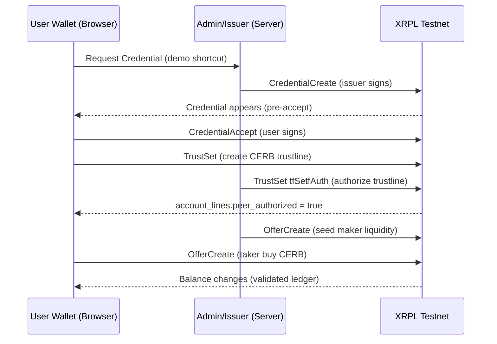

# Cerberus

XRPL Testnet demo replacing smart contracts, escrow, and off-ledger KYC flags with on-ledger Credentials + RequireAuth gating and DEX OfferCreate swaps - auditable, judge-ready RWA-like flow (no SCs).

Cerberus is a hackathon MVP blueprint + demo platform for **XRPL Testnet** showing how to build a realistic “RWA-like” flow **without smart contracts** by composing **native XRPL primitives**.

- **Compliance gating:** On-ledger **Credentials** + issuer **RequireAuth** trustline authorization so only “Verified” wallets can hold a gated **asset unit token**.
- **Trustless settlement:** XRPL **DEX atomic execution** via `OfferCreate` for RLUSD ↔ asset unit token swaps (Delivery‑versus‑Payment style settlement).

This is the core problem statement: **regulatory-style access control** (eligibility + transfer/holding restrictions) plus **trustless DvP-style settlement**, implemented with XRPL-native primitives instead of smart contracts or a private “verified” database flag.


Important demo note (reliability): the UI labels the quote asset as **“RLUSD (Simulated with XRP)”**. The intent is to demonstrate the _exact same settlement primitive_ (`OfferCreate`) without depending on sourcing Testnet RLUSD during a live demo.

References:

- Two-party demo runbook: [docs/SIMULATION.md](docs/SIMULATION.md)
- Demo-readiness fixes narrative: [docs/DEBUGGING_LOG.md](docs/DEBUGGING_LOG.md)
- App folder readme (run commands): [cerberus/README.md](cerberus/README.md)

## What’s Unique (judge highlights)

- **No smart contracts**: uses only ledger primitives.
- **Eligibility is on-ledger**: “Verified” is derived from XRPL **Credentials**, not a database flag.
- **Enforcement is issuer-side**: `RequireAuth` + trustline authorization prevents unverified wallets from holding the asset unit token.
- **Settlement is trustless**: swaps settle via XRPL DEX (`OfferCreate`), not escrow or off-ledger matching.
- **Demo-safe terminology**: uses “asset unit token” (not shares/investment language).
- **Definitive live checks**: any tx submission is treated as real only after `validated: true` and follow-up state queries.

## Why This Matters (real-world mapping)

Cerberus is intentionally a **Testnet demo**, but the building blocks map cleanly to real operational requirements in regulated finance and tokenized assets.

**Where this pattern shows up**

- **REIT-style flows / tokenized real estate access**: “asset units” model fractional exposure; eligibility gates (KYC/AML, suitability, jurisdiction) and transfer restrictions are core requirements.
- **Tokenized funds / private markets**: only wallets that passed eligibility checks (accredited investor, jurisdiction rules, transfer restrictions) should be able to hold the asset.
- **Trade finance / supply-chain credits**: counterparties must be authorized before they can receive/hold settlement assets or receivables.
- **Institutional onboarding**: a “Verified” state is usually off-ledger (databases, PDFs, emails). Here it is expressed **on-ledger** as a Credential.
- **Audit + dispute reduction**: third parties can independently verify *what* was authorized and *when* by reading the ledger.

**Why “purchasing” becomes simpler**

In many real asset workflows, buying is slow because eligibility checks, transfer restrictions, and settlement coordination happen across multiple systems. Cerberus compresses that into a clean sequence:

- **Eligibility** is written on-ledger (Credential) instead of a private DB flag.
- **Holdings control** is enforced by the issuer (`RequireAuth` + trustline authorization).
- **Settlement** happens atomically on-ledger via a single DEX `OfferCreate` that crosses existing liquidity.

That’s the same structure described in our internal spec: *credentialed eligibility → enforceable holding gate → atomic DvP-style settlement*.

**Why these XRPL primitives are helpful**

- **Credentials**: encode eligibility as an on-ledger object instead of a backend flag (reduces reliance on a single operator’s database).
- **RequireAuth + trustline authorization**: turns “eligibility” into enforceable holdings control (prevents unauthorized wallets from holding the issued asset).
- **DEX `OfferCreate` settlement**: demonstrates Delivery-versus-Payment style settlement without introducing an escrow smart contract or off-ledger matcher.

**What we optimized for a live demo (and why it matters in production too)**

- **Fewer moving parts**: the swap path uses the same `OfferCreate` primitive even when the UI labels the quote asset as “RLUSD (Simulated with XRP)”, avoiding brittle dependencies during demos.
- **Operational correctness**: we treat transactions as real only after `validated: true` + state queries (mirrors how real systems avoid “optimistic” accounting).

In short: this demo shows an architecture that’s closer to how real teams ship (compliance gating + enforceable transfer restrictions + atomic settlement), but expressed with XRPL-native primitives.

## How It Works (conceptual)

### 1) Compliance gating (holdings control)

1. The issuer issues a “Verified” Credential to your wallet **on the ledger**.
2. You create a trustline to the issuer for the Cerberus **asset unit token**.
3. Because the issuer has `RequireAuth` enabled, the issuer must explicitly authorize your trustline.
4. Only then can your wallet hold the gated token.

Why this matters: credentials express eligibility, and `RequireAuth` makes eligibility enforceable (not just a UI promise).

### 2) Trustless settlement (atomic swaps)

Cerberus uses the XRPL DEX. Swaps are executed by a single `OfferCreate` transaction that crosses existing offers.

- The transaction is atomic (it either succeeds or fails on-ledger).
- Fills can be partial depending on liquidity and price constraints.

Why this matters: the settlement outcome is finalized on-ledger without relying on a centralized matcher.

## Diagrams

### End-to-end flow (gating → authorized holding → swap)



### Runtime architecture

```mermaid
flowchart LR
   Browser[Browser UI (/)] -->|xrpl.js WS| XRPL[(XRPL Testnet)]
   Browser -->|HTTP| NextAPI[Next.js API Routes (/api/admin/*)]
   NextAPI -->|xrpl.js WS (server-side)| XRPL
   NextAPI -->|signs issuer tx| IssuerSeed[(ISSUER_SEED\nserver env)]
```

## Key Features

- On-ledger Credentials as the eligibility signal
- RequireAuth trustline authorization as the enforcement mechanism
- Native DEX swaps (`OfferCreate`) for RLUSD ↔ asset unit token trading
- Minimal admin UI route (`/admin`) to keep the demo smooth
- RLUSD issuer reference + currency discovery endpoint (no hardcoded hex guessing)
- Admin “Seed Liquidity” action to place demo offers
- Two-user simulation support: per-tab wallets + explicit “Create new user”

## Technology Stack

- Next.js (App Router)
- TypeScript
- `xrpl.js`

## Getting Started

### 1) Clone and install

- `git clone https://github.com/LurkingGoo/Fintech.git`
- `cd Fintech`
- `npm install` (or `pnpm install`)

### 2) Configure environment variables (secure setup)

Copy the template and fill in real values:

- PowerShell: `Copy-Item .env.example .env.local`
- CMD: `copy .env.example .env.local`

Then edit `.env.local` and populate:

- `ISSUER_SEED` (server-side only; required for `/admin` actions)
- `XRPL_WS_URL` (optional; server-side XRPL WebSocket endpoint)
- `NEXT_PUBLIC_XRPL_TESTNET_ENDPOINT` (optional; client-side XRPL WebSocket endpoint)

**Never commit `.env.local`.** The repo ignores `.env*` by default.

### 3) Run the app

- `npm --prefix cerberus run dev`
- Open `http://localhost:3000`

### 4) One-time issuer seed generation (admin only)

Only the person/machine running the server needs to do this (users do not).

1. Start the dev server.
2. Generate/fund the issuer and enable `RequireAuth`:

   - PowerShell (recommended on Windows):
     `Invoke-RestMethod -Method Post -Uri http://127.0.0.1:3000/api/admin/init | ConvertTo-Json -Depth 10`

3. Copy the returned `seed` value into `.env.local` as `ISSUER_SEED=...`.
4. Restart the dev server.

Why: the issuer must sign Credential issuance + trustline authorization; we keep the seed server-side to avoid client leaks.

## Definitive live check (best practice — do this before the demo)

Testnet conditions change. Do not assume the ledger is in the state you expect.

Before you attempt the demo flow, run a small script that:

1. Connects to XRPL Testnet (WebSocket).
2. Calls the `feature` RPC to confirm the **Credentials** amendment is enabled.
3. Confirms issuer account is funded and has `RequireAuth` enabled.
4. (If using real RLUSD) discover RLUSD currency encoding **from the ledger** (do not guess).
5. For every submitted transaction, verify success by:
   - waiting for `validated: true` on the transaction result, then
   - confirming the expected state via queries like `account_lines` (trustlines/balances) and `account_offers` (DEX offers).

This “definitive live check” prevents most demo failures (missing amendments, wrong currency encoding, insufficient reserves, or non-validated transactions).

## Demo Walkthrough (UI)

For the full two-party script, see [docs/SIMULATION.md](docs/SIMULATION.md).

**Admin (`/admin`)**

1. Ensure `ISSUER_SEED` is set in `.env.local`.
2. Confirm Issuer Status (funded, `RequireAuth` enabled).
3. Issue Credential to the user wallet.
4. Authorize the user’s CERB trustline.
5. Seed Liquidity (places a maker offer: sell CERB for **XRP**; UI labels this as “RLUSD (Simulated with XRP)”).

**User (`/`)**

1. Connect Wallet.
2. Request Credential (demo shortcut).
3. Accept Credential.
4. Set CERB Trustline (then wait for admin authorization).
5. Buy 10 CERB (DEX `OfferCreate` that crosses the seeded offer).

### Two-user demo (User #1 + User #2)

You can run two users in parallel using two tabs/windows:

1. Tab A: connect → choose **Create new user** → complete credential + trustline + authorization.
2. Tab B: connect → choose **Create new user** → complete credential + trustline + authorization.
3. `/admin` shows “Demo Users” (User 1 / User 2) and provides quick-pick chips for those addresses.

Why: wallets are stored per-tab (sessionStorage) so disconnecting one user does not log out the other.

## Known Constraints (read this before judging)

- XRPL Testnet can reset at any time.
- Trustlines and offers consume XRP reserve; underfunded accounts will fail.
- DEX offers can partially fill depending on liquidity.
- RLUSD currency encoding must be discovered live (`account_lines`); Cerberus avoids hardcoding it.
- This demo does not store PII and does not perform real KYC (it demonstrates the on-ledger *shape* of eligibility + enforcement).

## Docs

- [docs/SIMULATION.md](docs/SIMULATION.md) — two-party (issuer vs user) demo script
- [docs/DEBUGGING_LOG.md](docs/DEBUGGING_LOG.md) — the presenter-friendly debugging narrative
